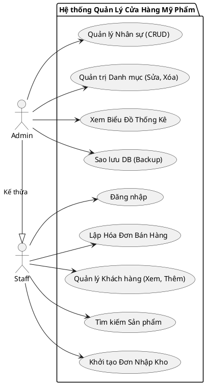
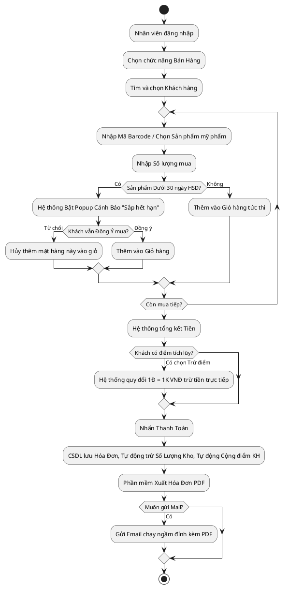

**LỜI CẢM ƠN**

Với lòng biết ơn sâu sắc, nhóm chúng em xin gửi lời cảm ơn chân thành đến **Thầy Nguyễn Minh Đạo**, giảng viên hướng dẫn môn học. Trong suốt quá trình học tập và làm đồ án, sự giảng dạy tận tâm, nhiệt tình cùng những lời góp ý quý báu của Thầy đã giúp chúng em có được định hướng đúng đắn, gỡ rối những khúc mắc về mặt chuyên môn và dần hoàn thiện tư duy lập trình phần mềm.

Đồng thời, chúng em cũng xin cảm ơn khoa CNTT đã tạo điều kiện cơ sở vật chất và môi trường học tập tốt nhất. Dù đã rất nỗ lực hoàn thiện đề tài, nhưng do giới hạn về mặt thời gian và kiến thức, đồ án chắc chắn không tránh khỏi những thiếu sót. Chúng em rất mong nhận được sự đóng góp và nhận xét từ Hội đồng Thầy/Cô để chương trình ngày càng hoàn thiện hơn.

Xin chân thành cảm ơn!

---

**LỜI MỞ ĐẦU**

Với sự phát triển mạnh mẽ của công nghệ thông tin và mức sống tăng cao, nhu cầu làm đẹp và chăm sóc cá nhân đã trở thành xu thế thiết yếu. Các cửa hàng mỹ phẩm mọc lên ngày càng nhiều đi kèm với khối lượng hàng hóa, nhãn hiệu cực kỳ khổng lồ. Việc quản lý kho xưởng bằng sổ sách thủ công hay file Excel truyền thống bộc lộ vô số yếu điểm như: khó tra cứu, thất thoát hàng hóa, không theo dõi được hạn sử dụng (Date) của mỹ phẩm và kém chuyên nghiệp trong khâu chăm sóc khách hàng.

Từ thực tiễn đó, nhóm chúng em quyết định lựa chọn đề tài **"Xây dựng ứng dụng quản lý cửa hàng mỹ phẩm"**. Phần mềm là một giải pháp toàn diện trên nền tảng Desktop (Java Swing) tự động hóa mọi quy trình từ Nhập kho, Phân loại sản phẩm, Bán hàng In hóa đơn, cho đến Quản lý hậu mãi (Gửi Email, Tích điểm Khách hàng). Qua đó, phần mềm hứa hẹn giải phóng tối đa sức lao động của con người, tăng tính chính xác trong công tác quản trị kinh doanh bán lẻ.

---

**MỤC LỤC**
LỜI CẢM ƠN
LỜI MỞ ĐẦU
CHƯƠNG 1: TỔNG QUAN HỆ THỐNG
   1.1. Khảo sát thực trạng
   1.2. Mục tiêu dự án
   1.3. Nền tảng công nghệ
CHƯƠNG 2: PHÂN TÍCH VÀ THIẾT KẾ HỆ THỐNG
   2.1. Phân quyền Người dùng (Actor)
   2.2. Biểu đồ Use Case (Nghiệp vụ)
   2.3. Sơ đồ Thực thể Liên kết (ERD / Class Diagram)
CHƯƠNG 3: TRIỂN KHAI CHI TIẾT CÁC CHỨC NĂNG
   3.1. Chức năng Đăng nhập Hệ thống
   3.2. Chức năng Quản lý Sản phẩm
   3.3. Chức năng Quản lý Khách hàng
   3.4. Chức năng Quản lý Nhà cung cấp & Thương hiệu
   3.5. Chức năng Bán hàng (Lập hóa đơn)
   3.6. Chức năng Quản lý Nhập Kho
   3.7. Chức năng Thống kê và Báo cáo (Dashboard)
   3.8. Chức năng Quản trị Nhân viên & CSDL (Chỉ Admin)
CHƯƠNG 4: TỔNG KẾT VÀ HƯỚNG PHÁT TRIỂN

=========================================

### CHƯƠNG 1: TỔNG QUAN HỆ THỐNG

**1.1. Khảo sát thực trạng**
Ngành mỹ phẩm đỏi hỏi khâu quản lý phức tạp hơn hẳn các mặt hàng thông thường vì tính chất đa dạng về chủng loại, thương hiệu, và đặc biệt là bị chi phối bởi **Hạn sử dụng**.

**1.2. Mục tiêu dự án**
Xây dựng một hệ thống phần mềm Desktop cài đặt nội bộ (Client-based) có giao diện trực quan, dễ thao tác với máy quét mã vạch, tự động thông báo hàng hết hạn và quản lý dữ liệu chặt chẽ từ Nhân viên bán hàng đến Quản lý cấp cao.

**1.3. Nền tảng công nghệ**
- **Java SE (JDK 17/21):** Ngôn ngữ chính, kiến trúc MVC.
- **Java Swing & FlatLaf:** Thiết kế Giao diện UI với chế độ Dark/Light mode hiện đại.
- **MySQL & Hibernate (JPA):** Hệ quản trị CSDL quan hệ vững chắc và ORM framework giúp ánh xạ Code trực tiếp thành SQL.
- **Thư viện mở rộng:** iTextPDF (Xuất Hóa đơn), JavaMail (Gửi mail chăm sóc), JFreeChart (Vẽ biểu đồ hình cột/tròn).

---

### CHƯƠNG 2: PHÂN TÍCH VÀ THIẾT KẾ HỆ THỐNG

**2.1. Phân quyền Người dùng (Dành riêng cho [ẢNH CHỤP MÀN HÌNH])**
Hệ thống được thiết kế chặt chẽ với hai cơ chế Actor chính: Admin (Quản trị viên) và Staff (Nhân viên bán hàng).
* **Quyền hạn của QUẢN TRỊ VIÊN (ADMIN)**: Nắm TOÀN QUYỀN thao tác trên hệ thống. Trực tiếp thực hiện các nghiệp vụ thay đổi cốt lõi (Sửa, Xóa dữ liệu). Quản lý mọi nhân viên, xem toàn bộ mục Thống Kê, và có Menu riêng được phép `Sao lưu toàn bộ Dữ liệu CSDL (Backup)` ra ổ cứng.
* **Quyền hạn của NHÂN VIÊN BÁN HÀNG (STAFF)**: 
  - Chỉ được nhìn thấy và sử dụng các giao diện danh mục để tra cứu (Xem, Tìm kiếm Sản phẩm/Khách hàng/Thương hiệu).
  - Được quyền Thêm mới thông tin Khách hàng, Lập hóa đơn Bán hàng (Có chiết khấu điểm) và Nhập hàng.
  - Tuyệt đối **không hiển thị Menu Thống Kê** để bảo mật nguồn thu doanh nghiệp. **Không có quyền bấm các nút XÓA hoặc SỬA** các danh mục cốt lõi. Giao diện của họ sẽ tự động khóa hoặc ẩn các phím bấm nhạy cảm.

*(Ghi chú: Tại phần này bạn chụp 2 màn hình, 1 màn hình của Admin có đủ vạch Menu Hệ thống & Thống kê, 1 màn hình Menu của Staff bị ẩn đi nhé)*

**2.2. Biểu đồ Use Case Tổng Quát**
*(Ghi chú: Dưới đây là code PlantUML, bạn Copy thả vào tool tạo thành ảnh)*

**2.3. Sơ đồ Hoạt Động (Activity Diagram) Nghiệp vụ Bán hàng**

---

### CHƯƠNG 3: CHI TIẾT CÁC CHỨC NĂNG HỆ THỐNG

Trong chương này, báo cáo làm rõ cơ chế vận hành của toàn bộ các modules thành phần:

**3.1. Chức năng Đăng nhập & Thay đổi Giao Diện**
- Quá trình đăng nhập khớp qua csdl bảng `staffs`. Controller sẽ nắm bắt phiên đăng nhập và định đoạt quyền UI.
- Có phím tắt Giao diện (Dark/Light Mode) ngay trang chủ giúp nhãn quan linh hoạt, chuyển đổi 1 nốt nhạc nhờ bộ engine giao diện phẳng FlatLaf.

**3.2. Quản lý Sản phẩm (Product)**
*(Ghi chú: Chừa chỗ để chèn ảnh giao diện [Quản lý sản phẩm]*
Cung cấp khả năng vận hành CRUD (Thêm, Đọc, Sửa, Xóa). Chức năng đỉnh cao là việc **Tìm kiếm** chính xác tên mỹ phẩm nhờ bộ lọc động. Đặc biệt, có gắn liền TextBox **Theo dõi Hạn Sử Dụng (Date)** làm cơ sở phân tích tuổi đời của lô hàng. Mọi thay đổi đều ràng buộc khóa ngoại với Thương hiệu (Brand) và Loại SP (Category). Nhóm quyền Staff chỉ có thể đọc và click vào bảng không được tùy ý can thiệp Sửa Xóa. 

**3.3. Quản lý Khách hàng (Customer)**
*(Ghi chú: Chừa chỗ để chèn ảnh giao diện [Quản lý Khách hàng]*
Không chỉ lưu trữ Tên, SDT cơ bản. Hệ thống đã code riêng một bộ máy thuật toán **Tích lũy điểm (Loyalty Points)**. Người quản lý có thể xem lượng Điểm thành viên. Khách hàng thân thiết dễ dàng được tìm thấy qua thanh "Tìm theo Số điện thoại".

**3.4. Quản lý Nhà cung cấp (Supplier) & Thương Hiệu (Brand)**
*(Ghi chú: [Chèn Ảnh Giao diện Nhà cung cấp] và [Thương hiệu]*
Đây là khối CSDL gốc (Master Data). Chức năng này kiểm soát các kho đối tác từ Hàn Quốc, Âu Mỹ giúp việc Nhập kho không bao giờ bị lệch dữ liệu. Tương tự, hỗ trợ Tìm Kiếm bằng Tên cực nhanh và bị vô hiệu hóa bảng thao tác đối với nhân sự cấp thấp.

**3.5. Nghiệp vụ Lập hóa đơn (Checkout/POS)**
*(Ghi chú: [Chèn ảnh Giao diện Lập Hóa Đơn]*
Là trái tim của dự án. Màn hình chia ra 3 cục: Chốt thông tin Khách (hiện rõ điểm tích lũy), Nhập hàng hóa và Tính Tiền.
- **Quy trình An toàn Mỹ phẩm:** Khi thêm 1 mặt hàng, nếu hàng đó hết hạn hoặc sát Date 30 ngày, hệ thống chặn lại và bung Popup đỏ hỏi ý kiến thu ngân.
- **Tiền tệ & Kế toán:** Nhấn nút sử dụng Điểm, hệ thống cấn trừ ngay (1 điểm cạp 1,000 VND), sau đó tự động đẻ ra điểm hoàn lại cho Bill này. Cuối cùng, Database tự động Commit lưu Invoice, trừ Tồn kho và Trực xuất Hóa Đơn PDF gởi thẳng cho Email người dùng hoàn toàn ngầm không gây đơ ứng dụng.

**3.6. Chức năng Thống Kê Báo Cáo (Dashboard)**
*(Ghi chú: Chừa chỗ [Chèn ảnh Bảng điều khiển/Thống kê]*
Chức năng chỉ dành cho Giám đốc/Quản lý. Nó cung cấp:
- 4 thẻ Label số báo lượng KH, Doanh thu trong ngày, Tổng DT mọi thời đại.
- **Xử lý Cảnh báo Đỏ:** Bộ đếm tự động soi chiếu kho, đưa những mặt hàng Mỹ phẩm còn "Dưới 30 ngày sống sót" vào vòng Cảnh báo. Một Bảng chuyên dụng được sinh ra chỉ để liệt kê "Đống rác hàng tồn hết date" này.
- Vẽ Biểu đồ Doanh Thu từ thư viện JFreeChart.

**3.7. Sao lưu CSDL và Phân quyền**
Hệ thống cho phép Quản trị viên (Admin) tạo nhân viên mới phân Role. Cực kì quan trọng: Admin có nút Click "Sao lưu Data" chạy gọi thẳng SQL Dump ở phần nền lùi data ra file `.sql` vĩnh viễn không mất dữ liệu cửa hàng.

---

### CHƯƠNG 4: KẾT LUẬN VÀ HƯỚNG PHÁT TRIỂN

**4.1. Kết quả đạt được**
Chương trình cơ bản đã hoàn thành 100% mục tiêu ban đầu từ Thầy Đạo giao phó. Giao diện trực quan đẹp mắt không thua kém các phần mềm Kiot Việt hay Haravan. Đáp ứng mượt mà các tình huống khó trong đồ án như nghiệp vụ Khuyến mãi điểm, xuất PDF, gửi Email và kiểm soát Date nghiêm ngặt của ngành Spa/Mỹ phẩm. SQL được tổ chức khóa ngoại đầy đủ và bảo mật không hổng dữ liệu.

**4.2. Khuyết điểm**
- Phần mềm còn chạy đơn luồng ở 1 số công đoạn nên tốc độ có thể bị ảnh hưởng nếu dữ liệu lên đến hàng triệu dòng. 
- Tính năng quét Barcode cứng còn phụ thuộc con trỏ chuột.

**4.3. Hướng phát triển**
- Sẽ đưa DB lên Cloud (AWS/Azure) để hỗ trợ nhượng quyền chuỗi hệ thống cửa hàng đa chinh nhánh.
- Tích hợp thêm AI dự đoán xu hướng mỹ phẩm Hot để phòng mua hàng chủ động làm kho. Mở rộng thanh toán qua Momo/VNPay API thay vì tiền mặt.
